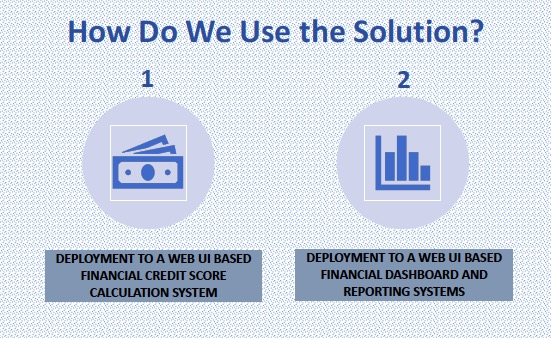
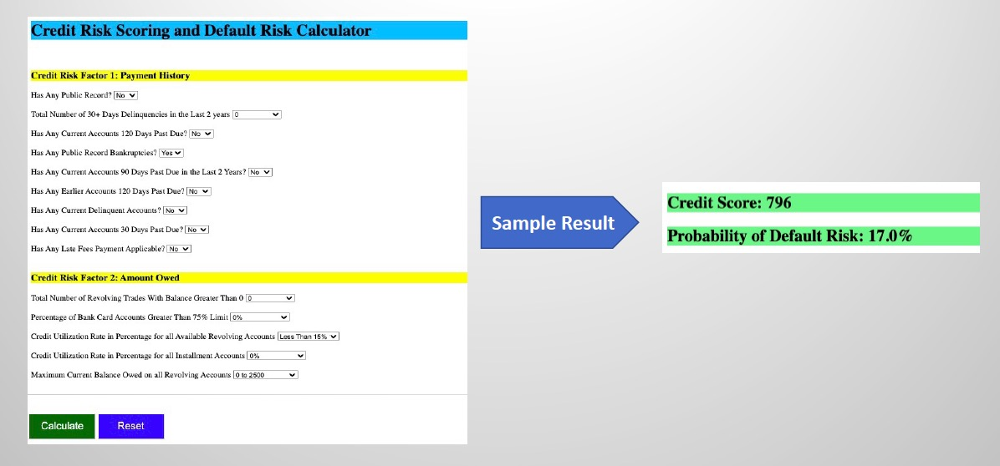

<h1><b>CREDIT RISK ASSESSMENT: A FINTECH FRAMEWORK USING DEEP LEARNING AND TRANSFER LEARNING</b></h1>

<h3>Credit risk analysis models serve as a tool for the financial institutions to make credit and lending decisions. A credit risk score is a numeral with three digits that represents the creditworthiness of an individual; while a credit default risk as per the Bank of England is a risk encountered by the lender when
the borrowing individual fails to repay the contracted loan payment. A credit risk scoring process is a set of procedures used to calculate the credit characteristics of an individual by applying mathematical computations and derive a three-digit numeral. This figure is utilized as a quantifier by the commercial banks and other lenders in the evaluation of the credit trust of its existing customers and the new individual loan applicants; to further make credit related business decisions of loan approval, credit default forecasts and expected loss forecasts in the event of a credit default
  
<h3>There exist numerous credit scoring models; but Fair Isaac Corporation (FICO) score is one of the most widely used scores by the lenders as a market standard for several years. The lenders rely predominantly on at least one of the FICO-based credit score reports issued by the three consumers credit reporting bureaus of Experian, Equifax, or Transunion as a primary source of trust and evidence to assess the credit status of an individual. The FICO scores range between 300 to 850 where a low score represents less trust while a high score denotes high trust to the lenders; and calculated based on the five key credit risk factors with the corresponding influential weightages namely 35% of payment history, 30% of amounts owed, 15% of credit history, 10% each of credit mix and new credit. But as the three credit agencies uses different versions of FICO algorithms; hence the score ranges and the actual scores vary between them. However, such FICO scores do not factor all the essential risk aspects like income, employment status and debt-to-income ratio required to be considered; which a lender would potentially prefer to factor in the assessment of an individuals’ credibility. This raised the need for the customized and automated system of credit risk scoring coupled with default risk to be developed within the lenders’ internal infrastructure; that mimics and reflects the capability of the FICO scoring model complemented with domain-driven approach to include lenders’ internal non-FICO risk factors; thereby to fulfill the totality of their evaluation requisites.</h3>
  
<h3>This project represents the credit risk assessment dual framework of predicting the credit scores in the range of 300 (poor score and least trust) to 850 (exceptional score and most trust) and the forecasts of the credit default risk probability of the individuals; which can be utilized by the financial institutions like commercial banks and lending firms to evaluate the credit worthiness of their customers and the new applicants.</h3>

<h3>The implementation is dealt that mimics and simulates the real-world FICO Scoring Model with the custom enhancements to include lender's internal credit risk factors by proposing a new Domain-Tech Feature Selection Approach along with Deep Learning and Transfer Learning techniques. This proposed fully-automated solution approach makes the credit risk assessment model more relevant and appropriate that fulfills the complete requisites of the lending firms unlike the FICO Scoring Model to evaluate the credibility of the individuals without any manual intervention; to further make effective credit related discussions.</h3>

<h3>This is the masters final project delivered as part of my course of studying Masters in Big Data Science Program at Queen Mary University of London (QMUL), United Kingdom (January 2021 to January 2022).</h3>
  
<h3>A copy of all the references used for the implementation of this project is attached</h3>

<h3><b><u>1. Dataset:</u></b></h3>
<h3>The Lending Club Dataset referred for this project is collected from the official Kaggle Website as below:</h3>
<h3><a href="https://www.kaggle.com/ethon0426/lending-club-20072020q1" style="color: blue"><b><u>Lending Club Dataset</u></b></a></h3>
  
<h3><b><u>2. Project Life-Cycle:</u></b></h3>
A data science problem solving life-cycle is implemented as illustrated below; with proposed contributions interms of the new domain-tech feature selection approach and transfer learning based architecture for credit risk modelling.
 
 
 
  

<h3><b><u>3. Proposed Transfer Learning Architecture:</u></b></h3>
Below is the proposed transfer learning architecture of the project with one source task and two target tasks:
 
 
 

 

<h3><b><u>4. Transfer Learning Data Split Approach</u></b></h3>
The project implements a standard data split approach to support the transfer learning's source and target tasks as illustrated below:
 
 
 

 

<h3><b><u>5. Proposed Domain-Tech Feature Selection Approach</u></b></h3>
As part of the project's implementation; a new 2-stage "Domain-Tech Feature Selection Approach" is proposed as illustrated in the below diagram:
 
 
 

 

<h3><b><u>6. Real-World Performance Results of the Models</u></b></h3>
Below snapshot represents the real-world performance outcomes of the source model and the two target models on the unseen test/production data:
 
 
 

<h3><b><u>7. Project Achievements</u></b></h3>
As part of this project's implementation; we were able to achieve below key points both from domain and technology perspective:

 

Domain:
* A real-world equivalent credit risk framework similar to the market leading FICO Scoring Model; amended with the additional business critical domain related enhancements to include the non-fico related credit risk factors that are considered critical by the lenders; to ensure completeness in the evaluation of the credibility of an individual.
* A single credit risk framework for the financial institutions that delivers dual solution of generating the credit scores and also the probability of the credit default forecast simultaneously in the real-time manner.
* A ready to deploy Minimum Viable Product (MVP) solution; that incorporates equivalent weightage to the domain aspects in comparison with that of the technical and technology related aspects.

Technology:
* A first of its kind Dual-Solution Credit Risk Framework implemented with a blend of two leading technologies of Deep Learning and Transfer Learning. 
* Derived a solution for the regression problem statement of predicting the credit scores of individuals from a binary classification problem of fico score status as "Good-" and "Good+" through the implementation of the Transfer Learning technology.
* Reusability of the existing learnings through the implementation of the Transfer Learning technology.
* Proposed and implemented a new feature selection approach named "Domain-Tech Feature Selection Approach".
* A reasonable and justifiable real-world performance results form a first of its kind solution to be leveraged by the financial institutions.
* A potential baseline credit risk model to be considered for any further future enhancements.

<h3><b><u>8. Real-World Business Use Cases to Use the Dual Solution</u></b></h3>
Below snapshot represents the possible business use cases to use the dual solution in the real-world scenarios.
 
 
 

<h3><b><u>9. Dual Solution Implementation in a Web Application</u></b></h3>
Below snapshot represents the implementation of the dual solution in a Web UI application for demonstration purposes.
 
 
 

 
