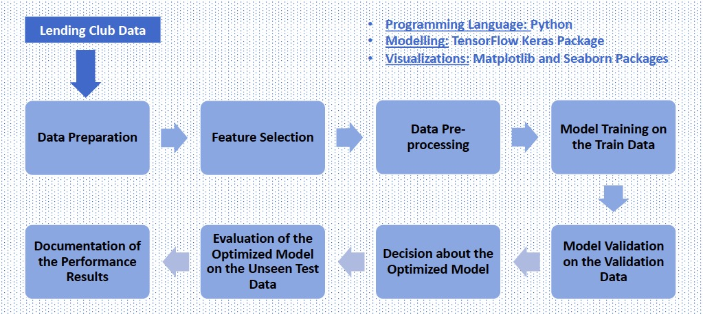
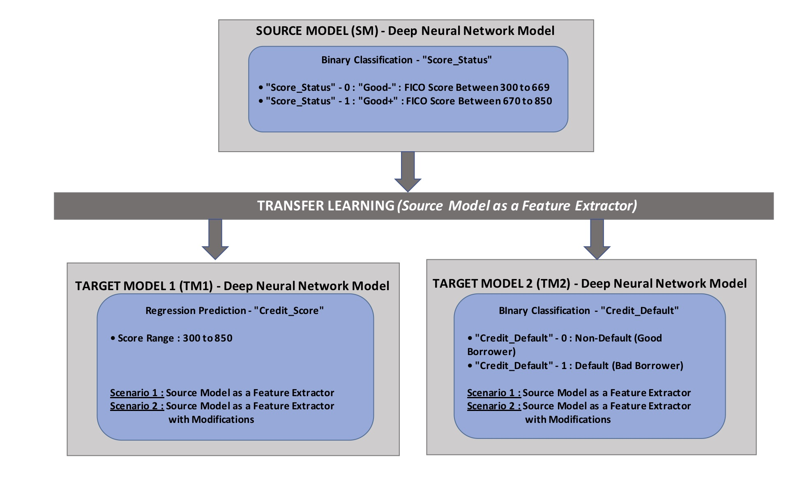
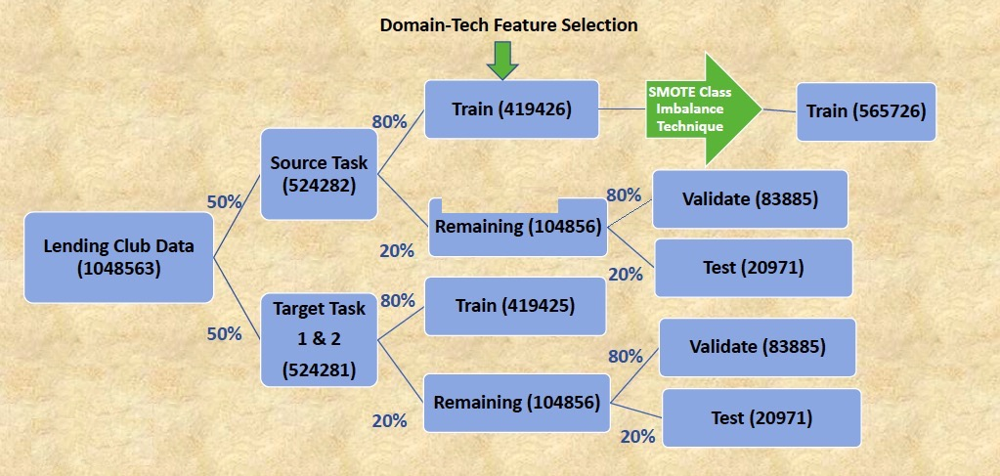
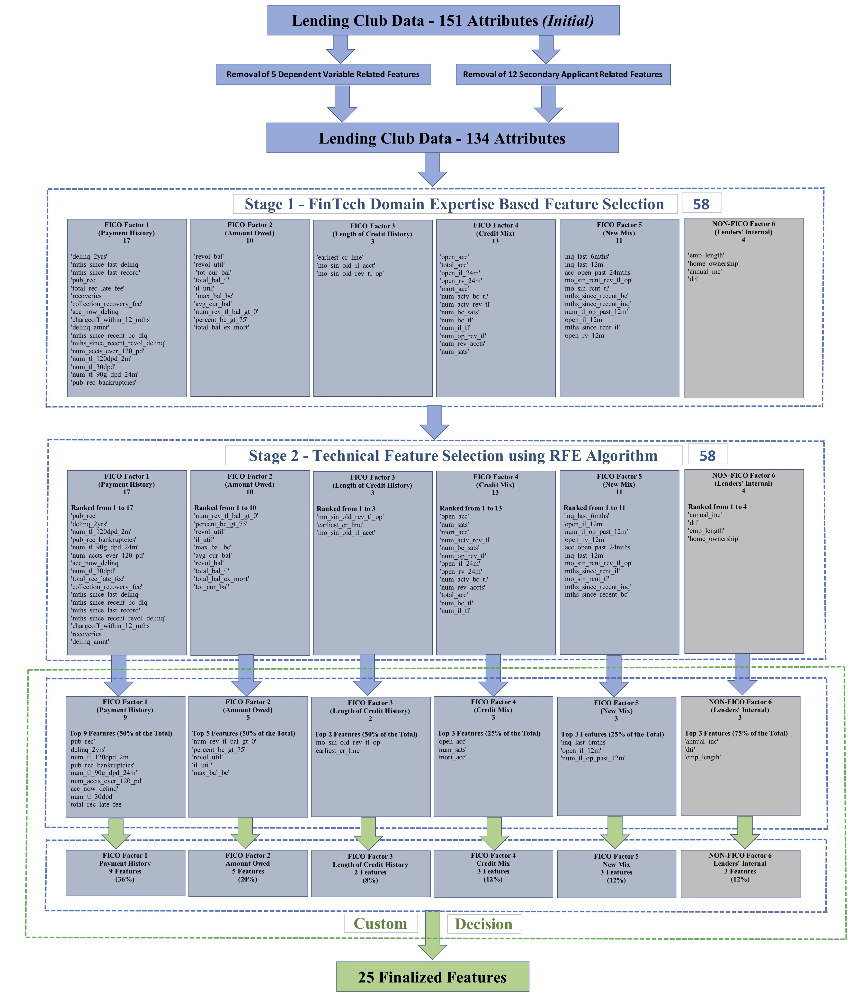
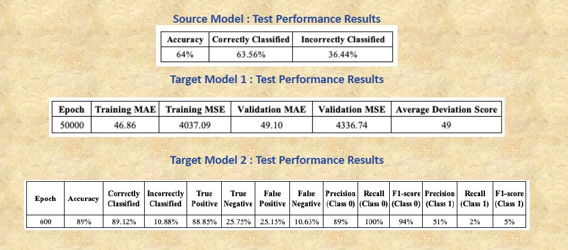

<h1><b>CREDIT RISK ASSESSMENT: A FINTECH FRAMEWORK</b></h1>

<h3>This project represents the credit risk assessment dual framework of predicting credit scores and the forecasts of credit default risk of the consumers of the financial institutions like commercial banks and lending firms.</h3>

<h3>The implementation is dealt that mimics the real-world FICO Scoring Model with the custom enhancements to include lender's internal credit risk factors by proposing a new Domain-Tech Feature Selection Approach along with Deep Learning and Transfer Learning techniques.</h3>

<h3>This is the masters final project delivered as part of my course of studying Masters in Big Data Science Program at Queen Mary University of London (QMUL), United Kingdom (January 2021 to January 2022).</h3>

<h3><b><u>1. Dataset:</u></b></h3>
<h3>The Lending Club Dataset referred for this project is collected from the official Kaggle Website as below:</h3>
<h3><a href="https://www.kaggle.com/ethon0426/lending-club-20072020q1" style="color: blue"><b><u>Lending Club Dataset</u></b></a></h3>
  
<h3><b><u>2. Project Life-Cycle:</u></b></h3>
A data science problem solving life-cycle is implemented as illustrated below; with proposed contributions interms of the new domain-tech feature selection approach and transfer learning based architecture for credit risk modelling.
 

 

<h3><b><u>3. Proposed Transfer Learning Architecture:</u></b></h3>
Below is the proposed transfer learning architecture of the project with one source task and two target tasks:
 

 

<h3><b><u>4. Transfer Learning Data Split Approach</u></b></h3>
The project implements a standard data split approach to support the transfer learning's source and target tasks as illustrated below:
 

 

<h3><b><u>5. Proposed Domain-Tech Feature Selection Approach</u></b></h3>
As part of the project's implementation; a new 2-stage "Domain-Tech Feature Selection Approach" is proposed as illustrated in the below diagram:
 

 

<h3><b><u>6. Real-World Performance Results of the Models</u></b></h3>
Below snapshot represents the real-world performance outcomes of the source model and the two target models on the unseen test/production data:
 

 

